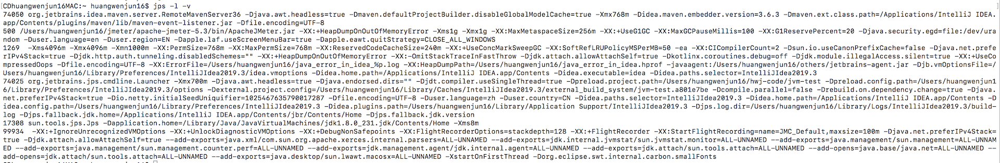
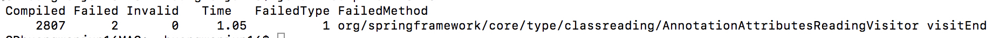
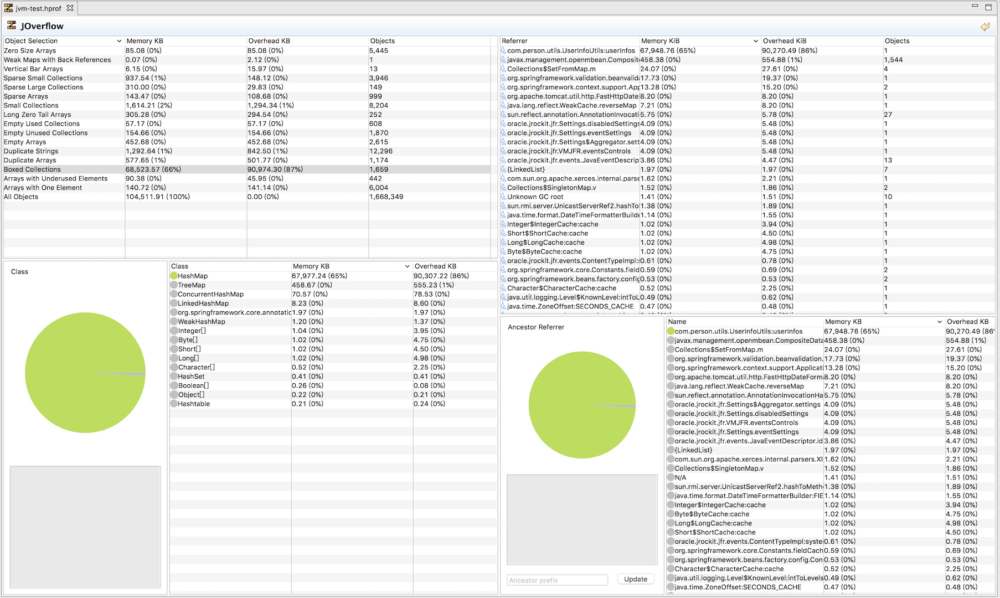
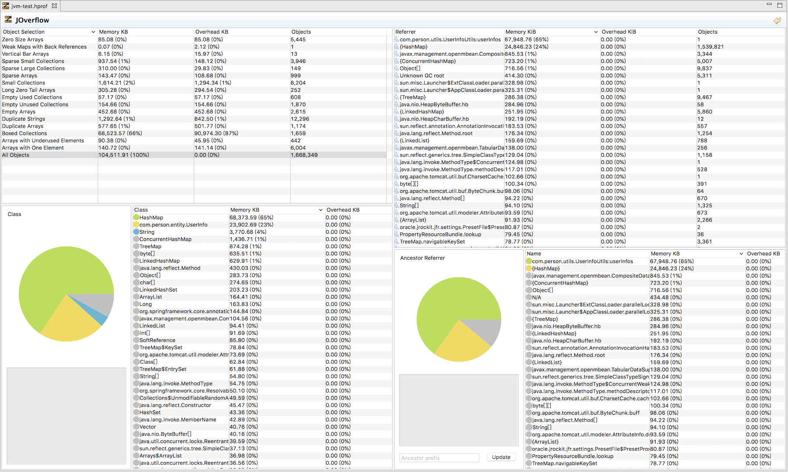

## 1.相关参数


## 2.GC日志字段说明


## 3.相关工具


- jps：显示虚拟机进程，常用如：`jps -l -v`
- jstat：收集虚拟机各方面的运行数据，常用如：`jps-gcutil 2764`、`jstat -gc 2764 250 20`
- jinfo：显示虚拟机配置信息
- jmap：生成虚拟机内存转储快照（headdump 文件），常用如：`jmap -dump:live,format=b,file=dump.hprof 28920`
- jhat：用于分析headdump 文件，他会建立一个http/html 的服务器，让客户可以在浏览器上查看分析结果，常用如：`jhat dump.hprof`
- jstack： 显示虚拟机线程快照，常用如：`jstack -l 11494`

### 3.1 jps 

基础信息，显示当前所有虚拟机进程，并标明PID

```
33217 Jps
89573 
91980 
```

详细信息，显示每个进程的详细配置



### 3.2 jstat

#### 简介

jstat命令可以查看堆内存各部分的使用量，以及加载类的数量。

命令的格式如下：

　　　　jstat [-命令选项] [vmid] [间隔时间/毫秒] [查询次数]

#### 命令功能说明

| 命令                    | 说明                       |      |
| ----------------------- | -------------------------- | ---- |
| jstat -class            | **类加载统计**             |      |
| jstat -compiler         | **编译统计**               |      |
| jstat -gc               | **垃圾回收统计**           |      |
| jstat -gccapacity       | **堆内存统计**             |      |
| jstat -gcnew            | **新生代垃圾回收统计**     |      |
| jstat -gcnewcapacity    | **新生代内存统计**         |      |
| jstat -gcold            | **老年代垃圾回收统计**     |      |
| jstat -gcoldcapacity    | **老年代内存统计**         |      |
| jstat -gcmetacapacity   | **JDK8 下 元数据空间统计** |      |
| jstat -gcutil           | **总结垃圾回收统计**       |      |
| jstat -printcompilation | **JVM编译方法统计**        |      |

#### 命令示例

**统计单位，未标明的 都是KB**
**类加载统计**

```
jstat -class 20120

Loaded  Bytes  Unloaded  Bytes     Time   
5762 10384.1        0     0.0       3.21

说明：
Loaded:加载class的数量
Bytes：所占用空间大小
Unloaded：未加载数量
Bytes:未加载占用空间
Time：时间
```
**编译统计**

```
jstat -compiler 20120
```



```
Compiled：编译数量。
Failed：失败数量
Invalid：不可用数量
Time：时间
FailedType：失败类型
FailedMethod：失败的方法
```

**jstat -gc**

```
jstat -gc 20120 250 20
```


```
S0C：第一个幸存区的大小   survive 0 count
S1C：第二个幸存区的大小
S0U：第一个幸存区的使用大小
S1U：第二个幸存区的使用大小
EC：伊甸园区的大小     Eden use
EU：伊甸园区的使用大小  Eden use
OC：老年代大小
OU：老年代使用大小
MC：方法区大小
MU：方法区使用大小
CCSC:压缩类空间大小
CCSU:压缩类空间使用大小
YGC：年轻代垃圾回收次数
YGCT：年轻代垃圾回收消耗时间
FGC：老年代垃圾回收次数  
FGCT：老年代垃圾回收消耗时间
GCT：垃圾回收消耗总时间

命令规则：
S-->Survivor 存活区
C-->Capacity 容量
E-->Eden     伊甸园
U-->Used     使用大小
O-->old			 老年代
M-->method   方法
CC-->compression class 压缩类
Y-->young    年轻代
GC-->garbage collection	垃圾收集(回收)
T-->time     时间
F-->full     全部
STW--> stop the world 整个世界都安静了
不带T的为次数，带T的为消耗的时间
```
 **特别说明**

1.伊甸园

2.压缩空间


**堆内存统计**

```
jstat -gccapacity  20120 250 20
```


```
NGCMN：新生代最小容量
NGCMX：新生代最大容量
NGC：当前新生代容量
S0C：第一个幸存区大小
S1C：第二个幸存区的大小
EC：伊甸园区的大小
OGCMN：老年代最小容量
OGCMX：老年代最大容量
OGC：当前老年代大小
OC:当前老年代大小
MCMN:最小元数据容量
MCMX：最大元数据容量
MC：当前元数据空间大小
CCSMN：最小压缩类空间大小
CCSMX：最大压缩类空间大小
CCSC：当前压缩类空间大小
YGC：年轻代gc次数
FGC：老年代GC次数

命令规则：
N-->new 新生代
G-->generation  一代
C-->capacity 容量
这里的GC和上个功能中的GC含义不同
MN-->MIN 最小值
MX-->MAX 最大值
E-->eden  伊甸园
S-->survivor 存活区
O-->old 老
CC-->compression class 压缩类
MC-->metaspace capacity 原数据大小
```

**新生代垃圾回收统计**

```
jstat -gcnew 
```

```
 S0C    S1C    		 S0U     S1U    TT MTT  DSS      EC       EU     				YGC     YGCT  
32768.0 32256.0    0.0    0.0  		2  15 	32768.0  498688.0 437054.6      9    		0.212
```

```
S0C：第一个幸存区大小
S1C：第二个幸存区的大小
S0U：第一个幸存区的使用大小
S1U：第二个幸存区的使用大小
TT:对象在新生代存活的次数
MTT:对象在新生代存活的最大次数
DSS:期望的幸存区大小
EC：伊甸园区的大小
EU：伊甸园区的使用大小
YGC：年轻代垃圾回收次数
YGCT：年轻代垃圾回收消耗时间

TT:Tenuring threshold 
MTTL:Maximum tenuring threshold
DSS:Desired survivor size
```

**新生代内存统计**

```
jstat -gcnewcapacity
```

```
NGCMN    NGCMX       NGC      S0CMX     S0C     S1CMX     S1C      ECMX        EC      			YGC   FGC 
87040.0  1397760.0   792576.0 465920.0  32768.0 465920.0  32256.0  1396736.0   498688.0     9     2
```

```
NGCMN：新生代最小容量
NGCMX：新生代最大容量
NGC：当前新生代容量
S0CMX：最大幸存1区大小
S0C：当前幸存1区大小
S1CMX：最大幸存2区大小
S1C：当前幸存2区大小
ECMX：最大伊甸园区大小
EC：当前伊甸园区大小
YGC：年轻代垃圾回收次数
FGC：老年代回收次数
```

**老年代垃圾回收统计**

```
jstat -gcold
```

```
MC       MU      	 CCSC     CCSU      OC          OU       		YGC    FGC    FGCT     GCT   
54360.0  51988.7   6784.0   6301.0    127488.0    23870.5     11     2    0.084    0.504
```

```
MC：方法区大小
MU：方法区使用大小
CCSC:压缩类空间大小
CCSU:压缩类空间使用大小
OC：老年代大小
OU：老年代使用大小
YGC：年轻代垃圾回收次数
FGC：老年代垃圾回收次数
FGCT：老年代垃圾回收消耗时间
GCT：垃圾回收消耗总时间
```

**老年代内存统计**

```
jstat -gcoldcapacity
```

```
OGCMN       OGCMX        OGC         OC         YGC   FGC    FGCT     GCT   
175104.0   2796544.0    121856.0    121856.0     9     2     0.096    0.356
```

```
OGCMN：老年代最小容量
OGCMX：老年代最大容量
OGC：当前老年代大小
OC：老年代大小
YGC：年轻代垃圾回收次数
FGC：老年代垃圾回收次数
FGCT：老年代垃圾回收消耗时间
GCT：垃圾回收消耗总时间
```

**JDK8 下 元数据空间统计**

```
jstat -gcmetacapacity
```

```
 MCMN  MCMX        MC       CCSMN    CCSMX       CCSC     	YGC   FGC    FGCT     GCT   
 0.0  1081344.0    35416.0  0.0  		1048576.0     4480.0     9     2    0.096    0.356
```

```
MCMN:最小元数据容量
MCMX：最大元数据容量
MC：当前元数据空间大小
CCSMN：最小压缩类空间大小
CCSMX：最大压缩类空间大小
CCSC：当前压缩类空间大小
YGC：年轻代垃圾回收次数
FGC：老年代垃圾回收次数
FGCT：老年代垃圾回收消耗时间
GCT：垃圾回收消耗总时间
```

**总结垃圾回收统计**

```
jstat -gcutil
```

```
S0     S1     E      O      M     CCS    	YGC    YGCT    FGC    FGCT     GCT   
0.00   0.00  91.60  12.31  96.92  94.18   9   	 0.259     2    0.096    0.356
```

```
S0：幸存1区当前使用比例
S1：幸存2区当前使用比例
E：伊甸园区使用比例
O：老年代使用比例
M：元数据区使用比例
CCS：压缩使用比例
YGC：年轻代垃圾回收次数
FGC：老年代垃圾回收次数
FGCT：老年代垃圾回收消耗时间
GCT：垃圾回收消耗总时间
```


**JVM编译方法统计**

```
jstat -printcompilation
```

```
Compiled  Size  Type Method
 5541     34    1 java/util/regex/Pattern$Dot isSatisfiedBy
```

```
Compiled：最近编译方法的数量
Size：最近编译方法的字节码数量
Type：最近编译方法的编译类型。
Method：方法名标识。
```

### 3.3 jinfo

```
Usage:
    jinfo [option] <pid>
        (to connect to running process)
    jinfo [option] <executable <core>
        (to connect to a core file)
    jinfo [option] [server_id@]<remote server IP or hostname>
        (to connect to remote debug server)

where <option> is one of:
    -flag <name>         to print the value of the named VM flag  输出对应名称的参数
    -flag [+|-]<name>    to enable or disable the named VM flag 开启或者关闭对应名称的参数
    -flag <name>=<value> to set the named VM flag to the given value  设定对应名称的参数
    -flags               to print VM flags  输出全部的参数
    -sysprops            to print Java system properties   输出系统属性
    <no option>          to print both of the above   输出全部的参数和属性
    -h | -help           to print this help message
```

MAC上有bug，官方说明:https://bugs.java.com/bugdatabase/view_bug.do?bug_id=8160376   据说缓存JDK 11就OK了

**jinfo -flag name=value**

使用 jinfo 可以在不重启虚拟机的情况下，可以动态的修改 jvm 的参数。尤其在线上的环境特别有用。

### 3.4 jmap

**jamp -dump pid**

获取当前jvm的dump文件，输出所有内存中对象到hprof二进制文件

### 3.5 jstack

生成线程快照

**jstack 检查死锁**

```
Found one Java-level deadlock:
=============================
"Thread-13":
  waiting to lock monitor 0x00007f90c28930f8 (object 0x00000007bee01a60, a java.lang.String),
  which is held by "Thread-12"
"Thread-12":
  waiting to lock monitor 0x00007f90c5937978 (object 0x00000007bee087b0, a java.lang.String),
  which is held by "Thread-13"

Java stack information for the threads listed above:
===================================================
"Thread-13":
	at com.person.service.impl.DeadThread2.run(DeadThread2.java:20)
	- waiting to lock <0x00000007bee01a60> (a java.lang.String)
	- locked <0x00000007bee087b0> (a java.lang.String)
"Thread-12":
	at com.person.service.impl.DeadThread1.run(DeadThread1.java:20)
	- waiting to lock <0x00000007bee087b0> (a java.lang.String)
	- locked <0x00000007bee01a60> (a java.lang.String)

Found 1 deadlock.
```

同时输出内容可以发现

- Thread-13等待锁监控资源(0x00007f90c28930f8)，被Thread-12占有
- Thread-12等待锁监控资源(0x00007f90c5937978),被Thread-13占有

死锁发送条件：

- 1、互斥使用，即当资源被一个线程使用(占有)时，别的线程不能使用

- 2、不可抢占，资源请求者不能强制从资源占有者手中夺取资源，资源只能由资源占有者主动释放。

- 3、请求和保持，即当资源请求者在请求其他的资源的同时保持对原有资源的占有。

- 4、循环等待，即存在一个等待队列：P1占有P2的资源，P2占有P3的资源，P3占有P1的资源。这样就形成了一个等待环路。

  如何破坏死锁：

- 1.互斥使用，无法破坏，既然是共享资源，那肯定是互斥的

- 2.不可抢占，一般无法破坏，除非一个线程等待时间过长，自动释放，不能被其他线程主动抢占

- 3.请求和保持：一般不可破坏，业务逻辑决定不能在抢占某个资源之前要释放其他资源，如果业务允许，那同一时间只会保留一个资源，就不会形成循环等待

- 4.循环等待，在上面三个条件都不能破坏的情况下，循环等待是最有可能被破坏，或者说能够保证不发生死锁的通用解决方案。

  为所有资源进行编号，如A、B、C

  如果一个线程使用自有的顺序为，A、C、B，再实际请求的时候，也是先请求A，再请求B，再C，然后执行业务逻辑

  多线程在请求资源的时候，按照编号顺序请求资源，如先获取A再获取B再获取C。这样在多个线程进来的时候，都获取A，抢到A的线程才能够继续执行，其他线程等待。

  如果所有情况，都必须同时获取到A、B、C才能执行，会降低执行效率，可以根据业务具体情况，抢到资源A，使用完成后可以释放，然后再抢B、C

  如此，永远不会发生循环等待，但是会**降低效率**

## 4.实例

### 4.1内存持续增加

**现象**内存持续增加，导致内存使用率过高，应用告警

**jvm配置:**无

**JMC分析dump文件**:


**结果分析：**

在所有内存占比中，mysql的connectionPhantomRefs集合占比较高，原因如下：

数据连接在空闲时间超过idleTimeout或生存时间超过maxLifetime后会被废弃，在connectionPhantomRefs集合中等待回收。因为连接资源一般存活时间比较久，经过多次Young GC,一般都能存活到老年代。如果这个数据库连接对象本身在老年代，connectionPhantomRefs中的元素就会一直堆积，直到下次 full gc

**解决方案**

- 1、减少废弃的数据连接对象的产生和堆积。

- 2、优化full gc时间.

  调整数据库连接池参数

  增加jvm配置参数，采用G1垃圾回收器

### 4.2 内存溢出

**现象**内存溢出，导致程序挂掉

**jvm配置**：-Xms20M -Xmx100M -Xmn20M -XX:+HeapDumpOnOutOfMemoryError -XX:HeapDumpPath=/xxx/jvm-test.hprof

**JMC分析dump文件**:





**结果分析**：

从上可以看出，在所占内存排行中，HashMap占比最高，并在图中可以看出是，com.person.utils.UserInfoUtils#userInfos

然后检查代码即可发现，是这里的缓存方式存在问题，导致内存一直增加，导致内存溢出


线程爆炸

无缘无故宕机


## 5.参考文档

1.[jdk api 说明文档](https://docs.oracle.com/javase/8/)